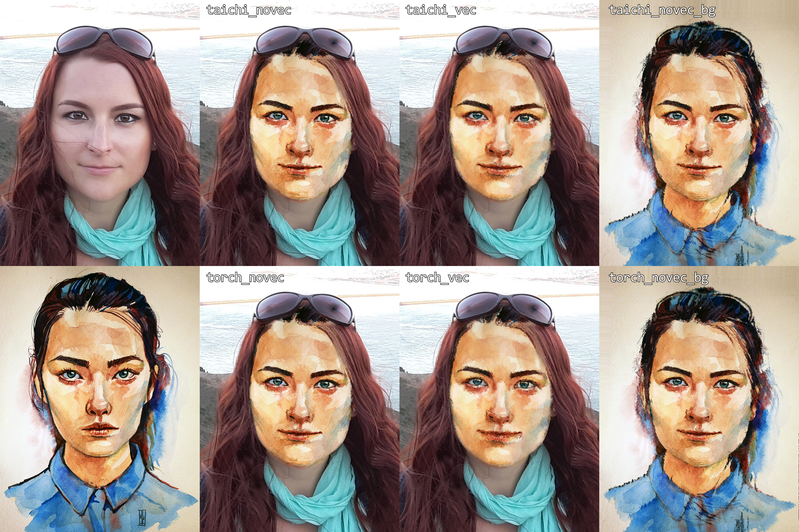

# FaceBlit (PyTorch)

Rewrite of [AnetaTexler/FaceBlit](https://github.com/AnetaTexler/FaceBlit) in PyTorch and Taichi, accelerated by Numba. Supports CUDA, CPU and MPS.

## Quick start

```bash
python src/faceblit_run.py
```



## Video face stylization

One can stylize a video, frame-by-frame, using this method. This only works for frames where a face is detected. Use EbSynth to propagate a stylized still instead, or use FastBlend, for temporal coherence and consistency.

```bash
python src/faceblit_run_video.py
```

Zuzka2 example from <https://github.com/OndrejTexler/Few-Shot-Patch-Based-Training#run> `testing-data.zip`

## Face detection model

To use Dlib's facial landmark model, download the 68-point landmark model at:

<https://github.com/AnetaTexler/FaceBlit/blob/master/VS/facemark_models/shape_predictor_68_face_landmarks.dat>

```bash
FaceBlit/models/
  model_files.md
  shape_predictor_68_face_landmarks.dat
```

- Dlib 68-point landmark model (needed for style precompute and target landmark detection):  
  <https://github.com/AnetaTexler/FaceBlit/blob/master/VS/facemark_models/shape_predictor_68_face_landmarks.dat>

Alternatively, use FAN detection backend (<https://github.com/1adrianb/face-alignment>)

## References

```bibtex
@Article{Texler21-I3D,
    author    = "Aneta Texler and Ond\v{r}ej Texler and Michal Ku\v{c}era and Menglei Chai and Daniel S\'{y}kora",
    title     = "FaceBlit: Instant Real-time Example-based Style Transfer to Facial Videos",
    journal   = "Proceedings of the ACM in Computer Graphics and Interactive Techniques",
    volume    = "4",
    number    = "1",
    year      = "2021",
}

@inproceedings{bulat2017far,
  title={How far are we from solving the 2D \& 3D Face Alignment problem? (and a dataset of 230,000 3D facial landmarks)},
  author={Bulat, Adrian and Tzimiropoulos, Georgios},
  booktitle={International Conference on Computer Vision},
  year={2017}
}

@Article{Texler20-SIG,
    author    = "Ond\v{r}ej Texler and David Futschik and Michal Ku\v{c}era and Ond\v{r}ej Jamri\v{s}ka and \v{S}\'{a}rka Sochorov\'{a} and Menglei Chai and Sergey Tulyakov and Daniel S\'{y}kora",
    title     = "Interactive Video Stylization Using Few-Shot Patch-Based Training",
    journal   = "ACM Transactions on Graphics",
    volume    = "39",
    number    = "4",
    pages     = "73",
    year      = "2020",
}
```
