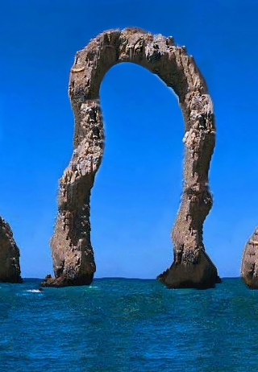

# ReEzSynth: A PyTorch-Powered Remake of Ebsynth

<!-- markdownlint-disable MD033 -->
<!-- markdownlint-disable MD045 -->

ReEzSynth is a complete, from-the-ground-up rewrite and enhancement of the original Ebsynth video stylization tool. It leverages the power and flexibility of PyTorch and a custom CUDA extension to deliver high-performance, high-quality video-to-video synthesis, while adding new features to dramatically improve temporal stability.

This project is designed for artists, researchers, and developers who need a robust, scriptable, and high-performance tool for temporal style transfer.

## Key Features

- **High-Performance CUDA Backend**: The core patch-matching and synthesis algorithm is implemented as a PyTorch C++/CUDA extension, ensuring maximum performance on modern GPUs.
- **Full Parity with Original Ebsynth**:
  - **Multi-Guide Synthesis**: Use multiple guide layers (e.g., edges, colors, positional maps) with individual weights.
  - **Modulation Maps**: Spatially control the influence of guides for fine-grained artistic direction.
  - **Weighted & Plain Voting**: Choose between sharp, detail-preserving synthesis (`weighted`) or a softer, more painterly style (`plain`).
- **New Advanced Features for Temporal Stability**:
  - **Temporal NNF Propagation (Experimental)**: Intelligently re-uses information from the previous frame to initialize the current one, drastically reducing flicker and improving detail preservation.
  - **Sparse Feature Guiding (Experimental)**: Automatically detects and tracks key features in the video, creating an internal guide that "pins" the style to moving objects and prevents sliding textures.
- **State-of-the-Art Pipeline**:
  - **Bidirectional Synthesis & Blending**: Processes video in both forward and reverse passes and seamlessly merges them with a high-quality Poisson solver (LSQR/LSMR) to eliminate jitter.
  - **High-Quality Optical Flow**: Integrates modern optical flow models (RAFT, NeuFlow v2) for accurate motion tracking.
- **Modern and User-Friendly**:
  - **YAML-based Projects**: Easily define and manage complex projects with simple configuration files for the command-line workflow.
  - **Full Python API**: A clean and simple Python API (`Ezsynth`, `ImageSynth`) allows for easy integration into larger graphics pipelines and creative coding projects.
  - **Caching System**: Automatically caches expensive pre-computation steps (like optical flow) to accelerate iterative workflows.

## Examples

| Face style | Stylit | Retarget |
|:-:|:-:|:-:|
|  |  |  |

`run_img_synth.py` Total time taken: 2.7780 s (RTX 3060, Ryzen 5 3600)

<!-- <Video here> -->

https://github.com/user-attachments/assets/0bdad993-e5ef-40bb-8c9a-47186e307fd5

Note: Pipeline Time includes saving to disk

| Blend method | Pipeline time (s) | Poisson Recon time (mm:ss) |
|-|-|-|
| none (f/r)  | ~73 | N/A |
| disabled    | 147 | N/A |
| seamless    | 164 | 00:17 |
| cg          | 192 | 00:52 |
| amg         | 235 | 01:31 |
| lsmr        | 299 | 02:36 |
| lsqr        | 351 | 03:33 |

EbSynth Single Pass time: ~46 s
Histogram Blending time: ~22 s

Setting:

- Number of frames: 100
- Resolution: 960x544
- Number of styles: 2 (first-last)

## Installation

### Prerequisites

1. **NVIDIA GPU**: A CUDA-compatible NVIDIA GPU with Compute Capability 3.0 or higher is required.
2. **CUDA Toolkit**: You must have the NVIDIA CUDA Toolkit installed. Tested with CUDA 11.x and 12.x.
3. **C++ Compiler**:
    - **Windows**: Visual Studio (2019 or newer) with the "Desktop development with C++" workload.
    - **Linux**: GCC/G++ (version 7 or newer).
4. **Python**: Python 3.8 or newer.
5. **Conda (Recommended)**: Using a Conda environment is highly recommended.

### Setup

1. **Clone the Repository**:

    ```bash
    git clone https://github.com/FuouM/ReEzSynth.git
    cd ReEzSynth
    ```

2. **Create and Activate a Conda Environment**:

    ```bash
    conda create -n reezsynth python=3.10
    conda activate reezsynth
    ```

3. **Install PyTorch with CUDA Support**:
    Visit the [official PyTorch website](https://pytorch.org/get-started/locally/) to get the correct command for your CUDA version. For example:

    ```bash
    pip install torch torchvision torchaudio --index-url https://download.pytorch.org/whl/cu121
    ```

4. **Install Dependencies and Build the CUDA Extension**:
    This single command installs all required Python packages and compiles the `ebsynth_torch` C++/CUDA extension.

    ```bash
    pip install .
    ```

    If the installation is successful, you are ready to go!

A prototype build is provided in the Releases

Build Environment:

- Operating System: Windows 64-bit
- Python Version: 3.10 (Conda)
- C++ Compiler: Microsoft Visual Studio 2022 (MSVC v14.41)
- CUDA Toolkit (System): 12.4
- PyTorch Version: A version built for CUDA 12.6 (this is fine)
- Target Architecture: x86_64 / amd64

```hash
SHA256 hash of ebsynth_torch-0.0.0-cp310-cp310-win_amd64.whl:
180c6eeb2e2f6aac4062069cdd0fa5928d577b8404ce34131fab87bd4a7ae703
```

## Usage

ReEzSynth can be used in two ways: via the command line for project-based work, or as a Python library for scripting and integration.

### Method 1: Command-Line (YAML Projects)

This method is ideal for managing full video projects.

**1. Prepare Video Frames**:
Extract your source video into a sequence of frames (e.g., PNGs).

```bash
python prepare_video.py --video "path/to/your/video.mp4" --output "projects/my_project/content"
```

**2. Create Keyframes**:
Select one or more frames, copy them to a `style` directory, and paint over them.

**3. Configure Project**:
Copy `configs/example_project.yml` and edit the paths for your project.

```yaml
# projects/my_project/config.yml
project:
  name: "MyFirstProject"
  content_dir: "projects/my_project/content"
  style_path: "projects/my_project/style/00123.png" # Path to your painted keyframe
  style_indices: [123]                                # Frame number of your keyframe
  output_dir: "output/MyFirstProject"
  cache_dir: "cache/MyFirstProject"
...
```

**4. Run Synthesis**:

```bash
python run.py --config "configs/example_project.yml"
```

The stylized frames will be saved to your specified `output_dir`.

### Method 2: Python API (Scripting)

This method is perfect for direct scripting, experimentation, and integrating ReEzSynth into other tools.

**Video Synthesis Example:**

```python
from ezsynth.api import Ezsynth, RunConfig

# 1. Configure parameters
config = RunConfig(
    pyramid_levels=5,
    uniformity=4000.0,
    use_sparse_feature_guide=True,
    use_temporal_nnf_propagation=True
)

# 2. Initialize the synthesizer
synth = Ezsynth(
    content_dir="projects/my_project/content",
    style_paths=["projects/my_project/style/00123.png"],
    style_indices=[123],
    output_dir="output/api_video_output",
    config=config
)

# 3. Run and get the results
final_frames = synth.run()
# Frames are saved automatically to output_dir and also returned as a list.
```

**Single Image Synthesis Example:**

```python
from ezsynth.api import ImageSynth, RunConfig, load_guide
from ezsynth.utils.io_utils import write_image

# 1. Configure parameters
config = RunConfig(patch_size=7, uniformity=4000)

# 2. Initialize the synthesizer
synth = ImageSynth(
    style_image="path/to/style.png",
    config=config
)

# 3. Run synthesis by providing a list of guides
stylized_image, error_map = synth.run(guides=[
    load_guide("source_guide1.png", "target_guide1.png", weight=2.0),
    load_guide("source_guide2.png", "target_guide2.png", weight=1.5),
])

# 4. Save the output
write_image("output/stylized.png", stylized_image)
```

## Configuration Details

All settings are managed via a central YAML configuration file (`configs/default.yml`) or the `RunConfig` class in the API.

### Key `ebsynth_params`

- `uniformity`: High values enforce texture consistency. Good default is `3500`.
- `patch_size`: Size of patches to match. Must be odd. `7` is a good balance.
- `search_pruning_threshold`: A speed optimization. Skips random search for patches with low error. A value of `50.0` is a good starting point.
- `*_weight`: Controls the influence of different guides (edges, color, position, etc.).

### Key `pipeline` settings

- `use_temporal_nnf_propagation`: Set to `true` to improve temporal stability.
- `use_sparse_feature_guide`: Set to `true` to track features and reduce sliding/jitter.

## How It Works

ReEzSynth operates in several stages:

1. **Pre-computation**: Optical flow fields and edge maps are calculated for the entire content sequence and cached to disk.
2. **Synthesis Pass**: The video is broken into sequences based on keyframe placement. For each sequence, the engine propagates the style from the keyframe to subsequent frames using the core patch-matching algorithm. This can be done forward or backward in time.
3. **Blending**: For sequences between two keyframes, the forward and reverse passes are intelligently blended. ReEzSynth uses a robust Poisson blending solver for this, ensuring a smooth and stable final output by minimizing temporal artifacts.

## Troubleshooting

- **`ebsynth_torch` not found**: This means the C++/CUDA extension did not build correctly. Ensure you have all prerequisites (CUDA Toolkit, C++ Compiler) and that your PyTorch version was installed with CUDA support. Re-run `pip install .` and check the build log for errors.
- **CUDA Out of Memory**: Video synthesis is memory-intensive. Try reducing the resolution of your content frames.
- **Visual Artifacts (Jitter/Flicker)**: Enable `use_temporal_nnf_propagation` and `use_sparse_feature_guide` in your config. These new features are specifically designed to solve these common problems. Adding more keyframes can also help.

## Acknowledgements

**jamriska** for the original EbSynth C++/CUDA source code: <https://github.com/jamriska/ebsynth>.

```bibtex
@misc{Jamriska2018,
  author = {Jamriska, Ondrej},
  title = {Ebsynth: Fast Example-based Image Synthesis and Style Transfer},
  year = {2018},
  publisher = {GitHub},
  journal = {GitHub repository},
  howpublished = {\url{https://github.com/jamriska/ebsynth}},
}
```

**Trentonom0r3** for the original Python API <https://github.com/Trentonom0r3/Ezsynth>.

**Zachary Teed** and **Jia Deng** for the Optical Flow **RAFT** model: <https://github.com/princeton-vl/RAFT>.

```bibtex
@misc{teed2020raftrecurrentallpairsfield,
      title={RAFT: Recurrent All-Pairs Field Transforms for Optical Flow}, 
      author={Zachary Teed and Jia Deng},
      year={2020},
      eprint={2003.12039},
      archivePrefix={arXiv},
      primaryClass={cs.CV},
      url={https://arxiv.org/abs/2003.12039}, 
}
```

**Zhiyong Zhang**, **Aniket Gupta**, **Huaizu Jiang** and **Hanumant Singh** for the Optical Flow **NeuFlow v2** model: <https://github.com/neufieldrobotics/NeuFlow_v2>.

```bibtex
@misc{zhang2025neuflowv2pushhighefficiency,
      title={NeuFlow v2: Push High-Efficiency Optical Flow To the Limit}, 
      author={Zhiyong Zhang and Aniket Gupta and Huaizu Jiang and Hanumant Singh},
      year={2025},
      eprint={2408.10161},
      archivePrefix={arXiv},
      primaryClass={cs.CV},
      url={https://arxiv.org/abs/2408.10161}, 
}
```

And Gemini 2.5 Pro (via Google AI Studio) for most of the coding.
